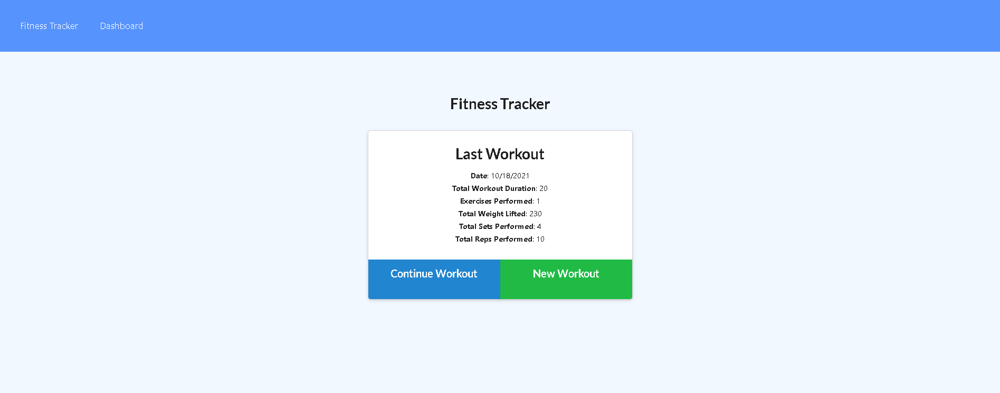
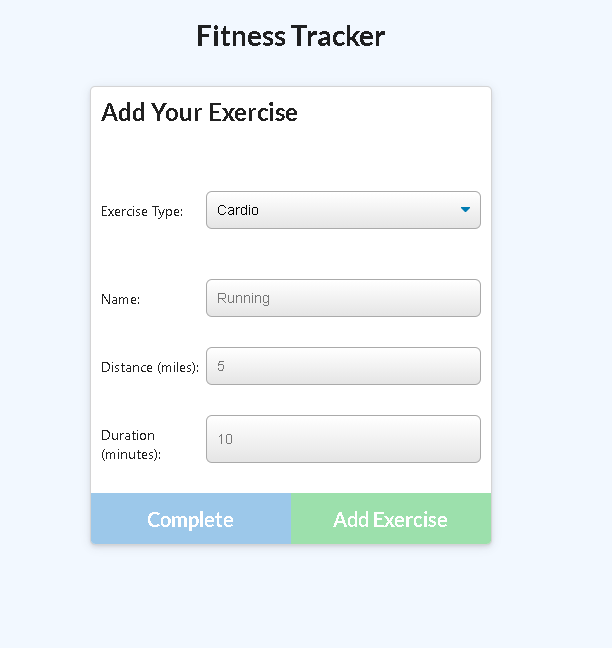
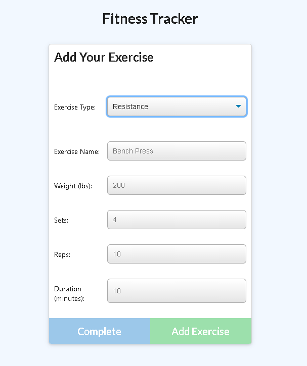
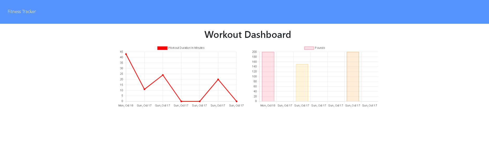

# WorkoutTrackerGio


## Description
A fitness app that keeps track of your progress and keeps a diary of the various workouts you complete throughout the day.

## Table of contents

* [Description](#description)
* [Installation](#installation)
* [Usage Information](#usage)
* [License](#license) 
* [Contribution](#contribution)
* [GitHub Repo and Heroku Application](#GitHub)
* [Images/Videos](#Images)
* [Contact Info](#questions)

## Installation
1. Clone Repo to your computer
2. Run the following command for proper installation of dependencies:
```
    npm install
```


## Usage Information
The first step is to open the indicated file (server.js) in an integrated terminal. 
Using Node.js, we use the following command:
```
node server.js 
```

Click on "New Workout" for first exercise day.

This new page gives you options for exercise input. As you progress on your workout routine, fill out the required information and submit each exercise with "Add Exercise". 

Once finished, click on "Complete" to finish your workout day

In the dashboard, you can view the durations of your workouts and the weights used

## License


This Project is licensed under [MIT](https://opensource.org/licenses/MIT)

## Contribution Guidelines
Thanks to:
* [https://docs.mongodb.com/manual/reference/operator/update/push/](https://docs.mongodb.com/manual/reference/operator/update/push/)
* [https://docs.mongodb.com/manual/reference/operator/aggregation/addFields/](https://docs.mongodb.com/manual/reference/operator/aggregation/addFields/)
* [https://docs.mongodb.com/manual/reference/operator/aggregation/sum/](https://docs.mongodb.com/manual/reference/operator/aggregation/sum/)
* [https://expressjs.com/](https://expressjs.com/)

## GitHub Repo and Heroku Application
* [https://github.com/gisosa531/WorkoutTrackerGio](https://github.com/gisosa531/WorkoutTrackerGio)

* [https://gio-workout.herokuapp.com/](https://gio-workout.herokuapp.com/)

## Images
Home Page:


Cardio Input:


Resistance Input:


Dashboard Stats:


## Contact Information
If you have any problems concerning the repo, please file an issue or email me at 
gio53196@gmail.com
The link to my work repositories is 
[Github Profile](https://github.com/gisosa531/).